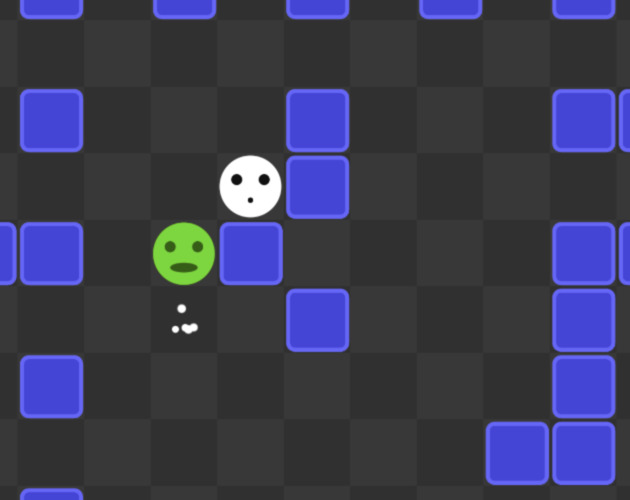

# Powers of Dropping

In this game, you have the power to drop blocks!

Connect lines or columns of blocks to remove them.
Clear all blocks or hit all catchers to win!

For the [js13kGames][js13kGames] challenge of [Gamedev.js Jam 2024][gdjam].
The theme was "Power".

You can play the original submission [here][play] or the slightly improved
post-compo version [here][postplay].

Use the cursor keys (or hjkl) to move and SPACE to drop a block.

Works on your phone, too. There are on-screen controls.

## Build Requirements

[esbuild][esbuild] is used for minification. You can get it with `npm`:

	$ npm install --global esbuild

[gdjam]: https://itch.io/jam/gamedevjs-2024
[js13kgames]: https://gamedevjs.com/jam/2024/#challenge-js13kgames
[play]: http://hhsw.de/sites/proto/gdjam2024/
[postplay]: http://hhsw.de/sites/PowersOfDropping
[esbuild]: https://github.com/evanw/esbuild
